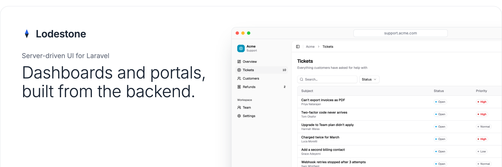

  

You describe what you want on the backend, and Lodestone produces the pages and components you need on the front end, built with Inertia and shadcn. All of your logic stays in PHP.

- List and record pages in a sidebar, with groups and badges
- Tables with search, filters, sort, pagination and header, row and bulk buttons
- Forms in a modal, a slide-over or a section
- Stats with sparklines
- Bar, line and area charts
- Record modals with tabs, sections, fields, markdown and code
- Any React component of your own, registered by name

## When would you use it?

- You need a dashboard, some reporting or a portal, for your team or your customers.
- You'd rather not maintain a React front end for it. shadcn does it all.
- You want a package that isn't tied to Eloquent, stays flexible, and is built for AI to write.

## Install

TODO

## Development

TODO
